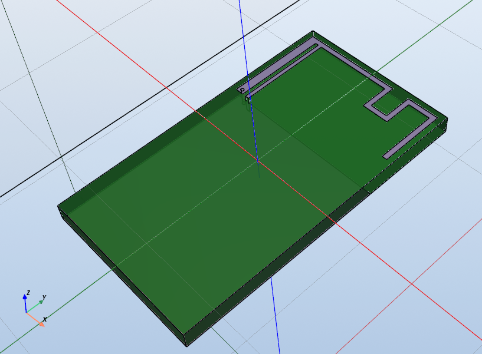

# MIFA / Multi‑Frequency MIFA Antenna Toolkit

This repo contains a small,  toolkit for building, simulating, and optimizing **inverted‑F (IFA / MIFA)** antennas using the awesome [Emerge](https://github.com/emerge) EM solver as its backend. It includes:

- A refactored antenna builder with clean parameter handling and basic geometry validation.
- Standalone demos for single‑band and multi‑band designs.
- Global and local optimizers with isolated runs, logging and checkpointing.

The code works with a CUDA‑capable solver (Emerge `EMSolver.CUDSS`) for speed, but also runs with CPU solvers like `PARDISO`. I havent tried it with HFSS yet.

## Installation
See the [EMerge README](https://github.com/FennisRobert/EMerge/blob/main/README.md) for installation instructions for the EM solver, I really recommend installing the CUDSS capable version as these examples are very computationally heavy.

To install this toolkit, clone this repository and install the required Python packages:

```bash
git clone git@github.com:fredriknk/EMerge_Optimizer.git
python -m venv emarge_env
source emarge_env/bin/activate  # On Windows use `emarge_env\Scripts\activate`
pip install emerge[cudss]
pip install -r requirements.txt
```
# Usage
I would recommend starting with the demo scripts provided in this repository. You can run them directly to see how the antenna designs are built, simulated, and optimized.

But in essence, the antenna builder has a main function `build_mifa_antenna(parameters: dict, validate: bool = True) -> em.Antenna` that takes a dictionary of parameters and runs the entire simulation, returning the *em.model, S11, freq_dense, ff1,ff2,ff3d* which are used in visualizing and analyzing the antenna performance.
You can modify the parameters in the demo scripts or create your own parameter dictionaries to explore different antenna designs. 

## MIFA Parameters
The MIFA antenna is defined by a set of dict parameters that control its geometry and performance. The parameters are run through a validator as default. Here is a breakdown of the key parameters used in the antenna design:

```
####################################################
#|------------- board_wsub-------------------------|
# ________________________________________________   _ 
#| A             |------ifa_l(total length)----|  |\ \_ board_th          
#| V__ifa_e_____  _______________     _________   | | A 
#|            A  |    ___  ___   |___|  _____  |  | | |
#|            |  |   |   ||   |_________| _ |  |__|_|_|_mifa_low_dist
#|         ifa_h |   |   ||     <----->     |__|__|_|_|_A__
#|            |  |   |   ||   mifa_meander   w2   | | | |  A                           
#|            |  |   |   ||   (center dist)       | | | |  | 
#|____________V__|___|___||_______________________| |_|_V__V 
#| <---ifa_e---->| w1|   wf               if_e2-<>| | |    |
#|               |<-fp-->|                        | | |mifa_tipdistance
#|                                                | | |(Opt)        
#|                                                | | board_hsub          
#|                                                | | |
#|                                                | | |
#|________________________________________________| | |
# \________________________________________________\|_V
#############################################################
#Note: ifa_l is total length including meanders and tip
# All lengths in meters, you can add *mm for millimeter 
# units from ifalib
```
### Single Frequency MIFA
To design a single-frequency MIFA antenna, you can specify the desired frequency and other geometric parameters
```python
mifa_14x25_2450mhz = { 
    'ifa_h': 0.00773189309, 'ifa_l': 0.0229509148, 
    'ifa_w1': 0.000766584703, 'ifa_w2': 0.000440876843, 'ifa_wf': 0.000344665757, 
    'ifa_fp': 0.00156817497, 'ifa_e': 0.0005, 'ifa_e2': 0.0005, 'ifa_te': 0.0005, 
    'via_size': 0.0003, 'board_wsub': 0.014, 'board_hsub': 0.025, 'board_th': 0.0015, 
    'mifa_meander': 0.00195527223, 'mifa_low_dist': 0.00217823618, 
    'f1': 2.3e+09, 'f0': 2.45e+09, 'f2': 2.7e+09, 'freq_points': 5, 
    'mesh_boundary_size_divisor': 0.33, 'mesh_wavelength_fraction': 0.2, 'lambda_scale': 1 }
```
Resulting in this antenna design:



some useful parameters to note are:
- 'f1': Simulation Start frequency, 
- 'f0': Center Frequency, 
- 'f2': Stop frequency, 
- 'freq_points': Number of simulation frequency points
- 'validate': Whether to validate parameters before building the antenna (default: True)

You can allso use parameter 
- 'sweep_freqs': np.array([2.45e+09, 5.00e+09]) instead of f# to define any number of frequency points directly at arbitrary intervals.

See [this example](demo_1_parametric_mifa_antenna.py) for a complete script with a few single frequency MIFA designs.

### Multi Frequency MIFA
To design a multi-frequency MIFA antenna, you can specify multiple frequency bands by providing defining multiple antennas in the same parameter dictionary. Each antenna can have its own set of parameters, allowing for independent control over their geometries and performance. For example, you can define two antennas for dual-band operation as follows:
```python

mifa_2450_5800mhz = { #Multifrequency MIFA from optimized with global optimizer
    #Main antenna parameters
    'p.board_wsub': 0.0191, 'p.board_th': 0.0015, 'p.board_hsub': 0.06,
    'p.sweep_freqs': array([2.45e+09, 5.80e+09]), 
    'p.sweep_weights': array([1., 1.]), #When optimizing with sweep_freqs, weights can be assigned to prioritize certain frequencies
    'p.ifa_e': 0.0005, 
    'p.ifa_e2': 0.000575394784, 
    'p.ifa_fp': 0.00272626454, 
    'p.ifa_h': 0.00829488465, 
    'p.ifa_l': 0.0234122232, 
    'p.ifa_te': 0.0005,
    'p.ifa_w1': 0.000435609747, 
    'p.ifa_w2': 0.000537390996, 
    'p.ifa_wf': 0.00062670221, 
    'p.mesh_boundary_size_divisor': 0.33, 
    'p.mesh_wavelength_fraction': 0.2,'p.lambda_scale': 1,
    'p.mifa_meander': 0.0023, 
    'p.mifa_low_dist': '${p.ifa_h} - 0.003', #Parametric link to ifa_h to simplify optimization
    'p.mifa_tipdistance': '${p.mifa_low_dist}', 
    'p.via_size': 0.0005,
    
    #Secondary antenna stub parameters, as long as we dont assign a new fp, it will have the 
    #same origin
    'p2.ifa_l': 0.00601520693, 
    'p2.ifa_h': '${p.mifa_low_dist}- 0.0005', 
    'p2.ifa_e': '${p.ifa_fp}', # we set ifa_e to ifa_fp since we don't use shunt 
    'p2.ifa_w2': 0.000388412941, 
    'p2.mifa_meander': '${p2.ifa_w2}*2+0.0003',#Parametric links can have arithmetic expressions 
    'p2.mifa_low_dist': '${p.mifa_low_dist} - 0.003', 
    'p2.mifa_tipdistance': '${p2.mifa_low_dist}', 
    'p2.shunt': False #Shunt is turned off on second antenna stub (Can be defined, but then set p2.ifa_e accordingly)
    #All other parameters use default values from p.X
    } 
```

This parameter set creates this dual-band MIFA antenna with two separate stubs.


[In this example](demo22_0_parametric_multifrequency_mifa2.py), we define two antennas: the main antenna with the prefix 'p.' and a secondary antenna with the prefix 'p2.'. Each antenna has its own set of parameters, allowing for independent control over their geometries and performance. You can use parametric links and arithmetic expressions to reference parameters from the main antenna, reducing the  number of variables when optimizing.

You can add any number of antennas by following the same pattern, using incrementing prefixes (e.g., 'p3.', 'p4.', etc.) for each additional antenna's parameters.


## Optimization

I have two optimizers included in this toolkit: a global optimizer based on Differential Evolution algorithms and a local optimizer using gradient descent. Both optimizers are designed to work with the MIFA antenna parameters and can be configured for single-frequency or multi-frequency optimization. When running it estimates total run time based on number of evaluations and simulation time per evaluation.

For all optimizations you need to define the parameter bounds for the optimizer to explore. This is done using a dictionary where each key corresponds to a parameter and its value is a tuple defining the (min, max) bounds.
Here is an example of defining parameter bounds for optimization:

```python
BASE_BOUNDS: Dict[str, Tuple[float, float]] = {
    'ifa_h':  (3.0*mm, 8.0*mm),
    'ifa_l':  (17*mm,   36*mm),
    'ifa_w1': (0.3*mm,  2*mm),
    'ifa_w2': (0.3*mm,  1*mm),
    'ifa_wf': (0.3*mm,  1*mm),
    'ifa_fp': (0.6*mm,  6*mm),
    'mifa_low_dist': (0.5*mm, 5*mm),
    "mifa_meander": (0.6*mm, 2*mm),
}

#or for a percent based span you can do something like this:

tweak_parameters = [
    'ifa_l',
    'ifa_fp',
    'ifa_h',
    'ifa_w1',
    'ifa_w2',
    'ifa_e2',
]

base_bounds = {}
span = 0.20  # +/- 20%
for k in list(params.keys()):
    if k in tweak_parameters:
        val = params[k]
        delta = val * span
        base_bounds[k] = (val - delta, val + delta)

# or a combination of both approaches, just dont try to define bounds for referenced parameters! If you want to optimize linked parameter antennas, you should normalize and denormalize them to populate values first, eg

normalize_parameters = normalize_params_sequence(params)
params = denormalize_params_sequence_flat(normalize_parameters)

#But this wil remove any parametric links, but its useful for the incrimental optimizer when tuning a decent design

```

The optimizer punishes invalid designs that violate physical constraints (as long as you set "validate": True) by assigning them a high cost, effectively steering the optimization away from those regions of the parameter space.

When the optimizer runs it will log progress to the console, including the best parameters found so far and their corresponding performance metrics.
When it finds new best parameters, it saves the dict to file, and you can paste them back into the demo scripts to visualize the results.

### Single Frequency MIFA Optimization
example of single frequency optimization can be found in [demo_optimize_mifa_2450mhz.py](demo_optimize_mifa_2450mhz.py)
For single frequency optimization its best to use the f0,f1 and f2 frequency parameters along with freq_points to define the optimization parameters. if you define the bandwidth parameters in the optimizer, the optimizer will try to maximize the bandwidth around within f1 and f2. while centering around f0.

These are the bandwidth parameters to include in the optimizer configuration for bandwidth optimization:

```
 bandwidth_target_db=-11.0, 
 bandwidth_span= [<from>, <to>]  # e.g., (p['f1'], p['f2'])
 bandwidth_parameters={
    "mean_excess_weight":1.0,      # Weight for mean excess reflection over the band span (under target)
    "max_excess_factor":0.2,       # Max excess reflection factor (under target)
    "center_weighting_factor":0.2, # Center weighting factor
    "mean_power_weight":0.1        # Mean power across band
}
```
This rewards designs that have a full span bandwidth below the target reflection level (e.g., -11 dB) within the specified frequency span. The weights can be tuned to prioritize different aspects of the bandwidth performance.

If you pass None for all the bandwidth parameters, the optimizer will fallback to single-point optimization at f0. In that case, you should define f0 = f1 = f2 since you only need a single point.

You can also use multi parameter antennas with single frequency optimization to achieve wide bandwidths.

### Multi Frequency MIFA Optimization

You can use the sweep_freqs and sweep_weights parameters to define the optimization frequencies and their relative importance. The optimizer will try to minimize the weighted reflection across all specified frequencies.
This allows you to run optimizations that target multiple frequency bands simultaneously. You can use a list of frequencies like this:

```
'sweep_freqs': np.array([2.45e+09, 5.80e+09]), 
'sweep_weights': np.array([1., 1.]), #When optimizing with sweep_freqs, weights can be assigned to prioritize certain frequencies
```
The sweep_freqs objective function will minimize the weighted sum of reflections at the specified frequencies, allowing for multi-band optimization.
